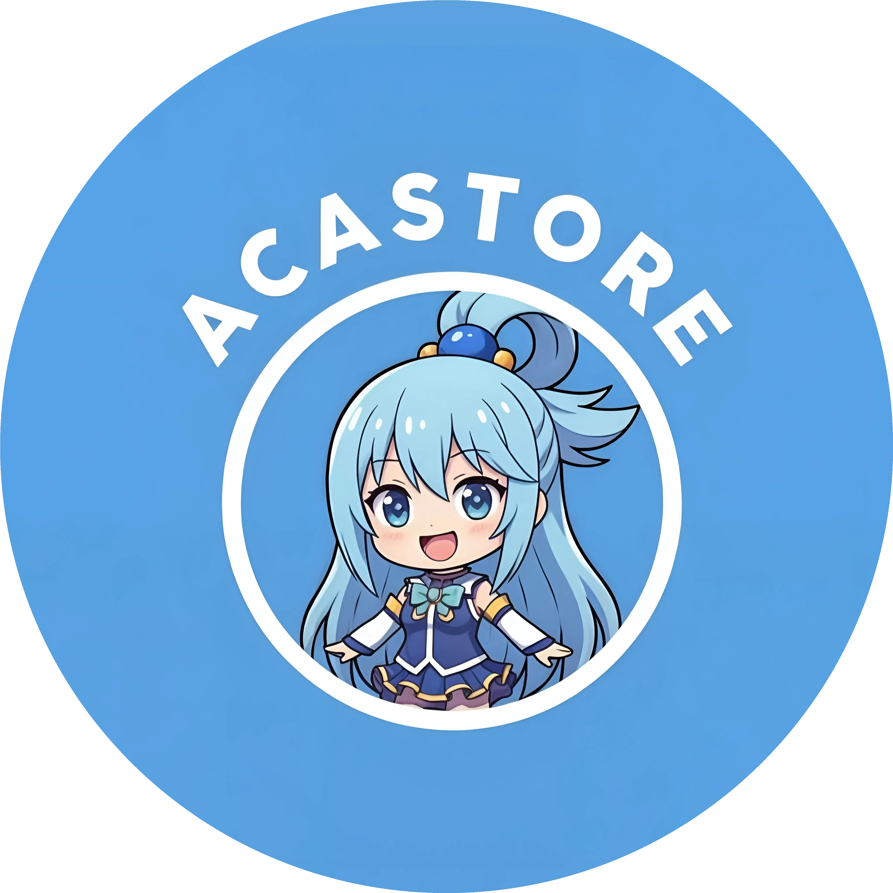

<p align="center">
  
</p>

<h1 align="center">AcaStore - Premium Game Top-Up Platform</h1>

<p align="center">
  Sebuah platform top-up game digital otomatis yang dirancang dengan antarmuka modern, cepat, dan aman. AcaStore mempermudah pengguna untuk melakukan transaksi pembelian produk digital dengan fitur konfirmasi pembayaran otomatis, manajemen stok, dan pelaporan keuangan real-time.
</p>

<p align="center">
  <a href="#fitur-utama">Fitur Utama</a> •
  <a href="#tech-stack">Tech Stack</a> •
  <a href="#prasyarat">Prasyarat</a> •
  <a href="#dokumentasi-instalasi">Instalasi</a>
</p>

---

## 🔥 Fitur Utama

### Untuk Pelanggan
*   **Antarmuka Modern (UI/UX)**: Navigasi responsif dengan dukungan Dark Mode.
*   **Checkout Instan**: Proses pemesanan yang cepat dan mudah tanpa langkah berbelit.
*   **Riwayat Transaksi & Invoice**: Histori pembelian tersimpan rapi dan dapat dicetak (PDF).
*   **Review & Rating**: Pelanggan dapat memberikan ulasan pada produk yang telah dibeli.
*   **Notifikasi Real-time**: Pemberitahuan otomatis via sistem ketika pembayaran dikonfirmasi atau status pesanan berubah.

### Untuk Administrator
*   **Dashboard Keuangan**: Ringkasan total pendapatan, penjualan per bulan, dan tren transaksi.
*   **Manajemen Produk**: Sistem CRUD (Create, Read, Update, Delete) lengkap dengan kontrol ketersediaan dan tipe input (ID Server atau Catatan).
*   **Sistem Log Aktivitas**: Pemantauan histori tindakan seluruh pengguna secara transparan.
*   **Verifikasi Pembayaran Manual**: Aman dari transaksi fiktif dengan pengecekan bukti transfer sebelum distribusi produk.
*   **Manajemen Pengguna (ACL)**: Hak akses khusus untuk role Admin dan Karyawan/User biasa.

---

## 💻 Tech Stack

Sistem ini dikembangkan menggunakan tumpukan teknologi (Tech Stack) modern, handal, dan berorientasi performa:

**Backend:**
*   **[Laravel 12](https://laravel.com/)**: Framework PHP elegan berkinerja tinggi.
*   **Inertia.js**: Penyatuan monolitik SPA (Single Page Application) tanpa API REST tambahan.

**Frontend:**
*   **[React 19](https://react.dev/)**: Library UI/UX reaktif.
*   **[Tailwind CSS v4](https://tailwindcss.com/)**: Utility-first CSS framework untuk desain cepat dan fleksibel.

**Manajemen Data & Ekosistem:**
*   **PostgreSQL / Supabase**: Basis data relasional mumpuni dengan integrasi cloud.
*   **DomPDF**: Engine rendering dokumen PDF untuk generator struk/invoice.

---

## ⚙️ Prasyarat (Prerequisites)

Sebelum melakukan deployment atau instalasi environment lokal, pastikan sistem Anda berjalan menggunakan komponen berikut:

*   **PHP** >= 8.2 (Ekstensi: BCMath, Ctype, Fileinfo, JSON, Mbstring, OpenSSL, PDO, Tokenizer, XML, GD)
*   **Composer** (Package Manager PHP)
*   **Node.js** >= 18.x & **NPM/Yarn** (Package Manager Javascript)
*   **Database Server** (MySQL / PostgreSQL disarankan)

---

## 🚀 Dokumentasi Instalasi (Local Development)

Berikut adalah panduan instalasi untuk menjalankan AcaStore di environment lokal:

1. **Clone Repository (Unduh Kode)**
   ```bash
   git clone <url-repository-anda>
   cd AcaStore
   ```

2. **Instalasi Dependencies (Backend & Frontend)**
   ```bash
   composer install
   npm install
   ```

3. **Konfigurasi Environment**
   *   Copy file `.env.example` lalu ubah namanya menjadi `.env`.
   *   Sesuaikan konfigurasi *Database* dan detail konfigurasi lain.
   ```bash
   cp .env.example .env
   php artisan key:generate
   ```

4. **Persiapan Database (Migrasi & Seeder Base)**
   ```bash
   php artisan migrate:fresh --seed
   ```
   *Catatan: Admin credential default bisa dicek di dalam file `DatabaseSeeder`.*

5. **Symlink Storage Media**
   ```bash
   php artisan storage:link
   ```

6. **Menjalankan Server Aplikasi**
   Buka dua jendela terminal/Command Prompt yang berbeda:
   
   *Terminal 1 (Backend - Laravel):*
   ```bash
   php artisan serve
   ```
   
   *Terminal 2 (Frontend - Vite):*
   ```bash
   npm run dev
   ```

Aplikasi sekarang dapat diakses melalui browser pada `http://localhost:8000`.

---

## 🛡️ Kebijakan Keamanan (Security)
Platform ini dibangun dengan praktik keamanan web modern:
*   Pencegahan CSRF & XSS aktif secara default (Via Laravel middleware).
*   Password hashing menggunakan BCrypt.
*   Penjadwalan optimasi *race condition* (Sistem Locking Database) saat limitasi batas persediaan barang terjual habis secara bersamaan.

Bila Anda menemukan celah atau *bug* keamanan, dimohon untuk **TIDAK** membuka isu publik dan segera melapor langsung melalui email pengembang / Admin di organisasi.

---
<p align="center">
  <i>Dikembangkan dengan kebanggaan untuk pengalaman top-up yang lebih baik.</i>
</p>
